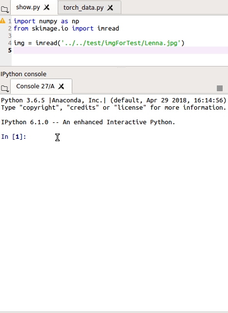
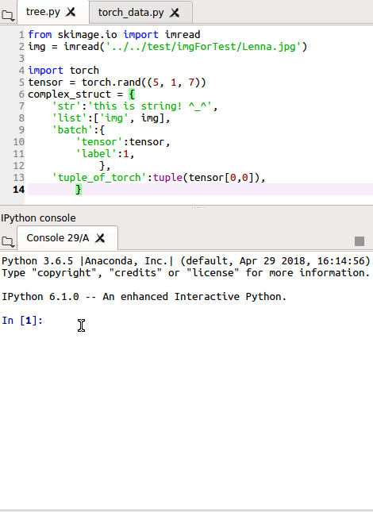
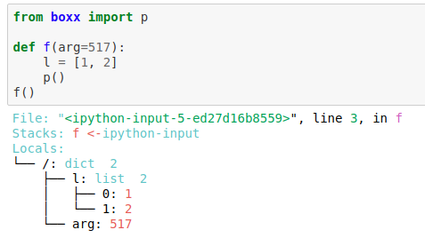

## 开发, 调试计算机视觉代码有哪些技巧？

抛砖引玉, 介绍一个Python 工具包 [**`boxx`**](https://github.com/DIYer22/boxx)


在调试视觉代码时, 基本就是和多维数组打交道, 多维数组有非常多的属性，打印起来比较麻烦。 `boxx.loga` 可以快捷地展现出一个多维数组的绝大多数属性.    
    

💡 **Note:** `loga` 是 "log array" 的缩写, 若 `array` 里面还含有 `nan` 或 `inf`, `log`也会一并提示出来。`loga` 支持 `numpy`, `torch.tensor`, `mxnet.ndarray`， `PIL.Image` 等 可以转为 `ndarray` 的数据类型。


做计算机视觉，可视化图像和 feature 非常重要。`boxx.show` 能提供更智能便捷的可视化。   
    
💡 **Note:** `show` 会在复杂的数据结构中 找出所有可能是图像的矩阵，并一一显示(`plt.imshow`)出来。 当然，`show` 也支持 `numpy`，`torch`，`mxnet` .etc


在开发 CV 代码时，会遇到一些复杂的 dict，list（比如 batch、模型参数）。`boxx.tree` 可以直观地展示复杂结构。   
    

💡 **Note:** 在理解和适配别人的代码时，经常用到 `tree`。`tree` 还支持自动从 `torch.Dataloader/Dataset` 中 sample 一个 batch 来可视化 (P.S. `boxx.show` 也支持) 


以上三个工具是我在视觉领域经常用到的工具, 接下来介绍一些通用的 Python 开发调试工具，只要写 Python 代码，都能用上。

打印变量是最简单、直接的debug方式, 那能不能更简单？   
    

💡 **Note:** `boxx.p` 使用了 magic method, `p/x` 便会打印 x 并返回 x。这样便可以在任何地方打印，比如 例子中的 `p/randint(0, 3)` 就不需要新建变量便可直接打印


在函数内运行 `p()`，便会将函数或模块内的所有变量及变量名一同打印(相当于快捷打印 `locals()`)    
    

💡 **Note:** 在函数内 `import boxx.p` 和 `p()` 有相同的效果


许多数情况下， 直接 `print` 无法获得调试的关键信息。 比如训练 loss 跑飞了, 导致 Bug 的可能是 `tensor` 的尺度/类型不对, 矩阵里有 nan , inf 等情况。比如之前我就遇到 [梯度含有nan](https://www.zhihu.com/question/67209417/answer/277425438) 的情况

这时 就必须对矩阵进行分析, 比如
 1. 在调试处加上print(x.mean(), np.hasinf(x),.np.hasnan(x))
 2. 设置断点进行分析    
 
方法1 每改一次调试代码 都要运行整个代码, 不灵活，操作也繁琐。方法2中 进入和退出 Debug console 比较麻烦，Debug console 本身也不太好用（没有自动补全功能） 

`boxx.g` 提供了一种新的方式，可通过 `g.name` 将变量传到当前的 Python 交互终端   
    

变量传到 Python 终端后，就能对变量进行全面分析了，比如 使用 `loga` 来分析

💡 **Note:** 

1. `gg` 和 `g` 的用法一样, 但 `gg` 会在传输的同时 打印出变量. 
2. 需要注意， 如果之前在终端中存在该变量名称，则变量的值将被新值覆盖.

在函数内运行 `g()`，便会将函数或模块内的所有变量一同传到当前的 Python 交互终端     
    

这样 任何错误都可以在终端中复现和分析了。当然， 注意不要让重要的全局变量被覆盖掉。

💡 **Note:** 在函数内 `import boxx.g` 和 `g()` 有相同的效果


刚才讲了对变量的两类操作 打印和传输到终端，`p/x` 和 `g.name=x` 是对单个变量操作，`p()` 和 `g()` 则是对整个函数或模块内的变量(`locals()`)进行操作，
在开发调试中, 经常要打印多个变量, 这时候wp 排上了用场(with print 的缩写):
```
def funcation(input=None):
     string = "This is str"
     rgb = skimage.io.imread("")
     batchs = [{img:rgb, label:string}]
    return batchs
```
把要打印的多个变量的定义 放入 with wp: 结构中, wp能把多个变量一起打印，而且wp还能可视化常见的数据类型 及其内部结构(支持dict seq np th mx pil 等 )。

但是 输入 with wp:-> 选择代码块 -> 按tab , 调试完还要复原代码，也有点繁琐。 还有个更简洁地打印方法。直接p()
```

```
p() 会打印出当前调用帧的所有局部变量, 比如 函数的 input 也打印出来了.  但是,  一些情况下 print 是无法获得调试的关键信息. 比如矩阵变量 光看shape，是不够的, 导致Bug的可能是矩阵值的尺度/分布不对, 矩阵里有 nan , inf, 等情况 比如之前我就遇到 链接 梯度含有nan的情况

这时 就必须对原始的矩阵进行分析, 比如
1. 在调试处加上print( x.mean(), np.hasinf(x),.np.hasnan(x)) 或者 直接boxx.loga(x)来分析矩阵对应的属性
2. 或者 使用 ipbd 进行分析。
方法1每改一次调试代码 都要运行整个代码,不灵活。方法2中 ipbd 里面没有补全, 进入和退出ipbd 也比较麻烦。 

g 可直接将变量传到 Python交互终端
```

```
 ~~p()  在打印局部变量的同时 还会把调用处的全局变量和局部变量 都复制到p的内部空间, 这样就能在交互的python 环境中 通过`p.变量名`直接获得对应变量。
>>> np.hasnan(p.x)
(链接 什么是 frame 什么事全局变量和局部变量)

但是 这还不够 调用的每个local变量都要加前缀 p. 太繁琐, 我又写了个 out 

```

```
out 不仅会调用一遍p, 会直接把 locals 变量写入你的交互环境里 并提示处 哪些变量~~

总结一下 p wp out ll logc
```
p/x 在调试时 基本可以替代 print
wp 当函数比较长 局部变量比较多时, 用with wp: 框起要打印的变量们
p()  函数locals 变量少 或 不想影响交互环境下的变量 即 name==main
out() 想最方便的操作locals的情况
```


~~ p, out 可视化结构功能是使用的 tree 函数, 可以 直接调用 tree(struct)可视化任何结构。此外 我用的 PyTorch 为主力视觉框架,  tree 还支持从torch 的 Dataloader 和 Dataset 中采样并可视化, 这样适配CV代码会方便很多.~~
```
tree-dataloader
```
 dict 经常用来存储属性, 但是 字典调用属性麻烦 dic[`label`] 我继承 dict 写了一个dicto, 调用属性和 JavaScript 一样方便, 
我还在 boxx 中 内置了一个

tree show what npa tprgb 都是调试代码时 才用到的工具, 使用频率很高 人生苦短 为了少打括号 以上方法全都支持减号来调用 call即 fun-x 来调用

说完调试 再说一下性能调优

timeit 是个方便的计时工具 将想要计时的代码放入 with 结构中就OK

面对数百上千GB的数据. 在数据清洗和预处理时 要榨干服务器的每一个线程来加速 写多进程 Python 是必备技能  但Python多进程的几个范式都显得繁琐 我参照map的思想和用法把多进程操作封装为 mapmp 函数( mean Map for Mulit Processing) mapmp用法和map一样

只需做俩件事, 1. 把for循环转换为map形式输入mapmp, 2. 尽量把 mapmp操作放在 __name__ == "__main__" 中, 这就开启了多进程加速, 默认进程数为 CPU 线程数, 在mapmp中 添加 pool=int 可手动设置进程数, 经验之谈 在加速含有 矩阵运算时候 最好用 testmapmp 检测一下加速比，因为 mkl优化版numpy 在多线程中会更慢

对于加速下载图片 爬虫等高IO操作 有个多线程版本的mapmt(mean Map for Mulit Threading) 用法和mapmp一样, 但没有 __name__ == "__main__" 这个限制
性能分析:
```
crun
```
heatmap

使用 what(anything) 可以快速解构任何元素
```
what-frame
wtf-frame.f_code
```
若觉得 what 四个字符不够迅速 可以用 wtf 等效替代
尤其是当用到一个不熟悉的框架, 或者新的包时, what(~~wtf~~ )配合help 会节省许多查文档的时间


安装 `pip install boxx` 兼容Python 2/3, win/osx/linux

项目的GitHub地址 内有更详细的说明

分享一下个人的感受
由于我受不了
1. 远程编辑的延迟
2. 开发也离不开qt-IPython

所以 一直用 Anaconda 自带的Spyder 作为 Python 开发的 IDE. Spyder 虽然不强，但只要有 qt-IPython, 加上自己写的工具，调试起来还是很方便, 顺手。因此, 我开发的工具都尽可能地直接, 简洁。 我还写了一些直接在IPython 内调用的IDE功能的工具, 来弥补Spyder 的不足以。 比如 :
```
findinRoot("tree")
```

  
之前在实验室一直是本地GPU环境调试 比较方便。开始实习后, 旷厂不提供本地GPU。我主力是是PyTorch, 为了方便调试  我写了个`boxx.ylth`包 如果检测到没有cuda环境 会强行使 `.cuda()` 操作无效。只要在代码开头 `import boxx.ylth` 大多数 gup 的 torch 代码, 可以不经更改 直接在cpu上运行和调试。(这操作太暴力 请慎用)


我的工作流一般是
在本地开发调试, 代码同时兼容云端和本地，用 `boxx.sysi` 检测运行环境 并自动切换, 本地开发调试OK了, 用 `rsync` 命令 只传改过的 .py 文件到服务器 再train

虽然传代码比较麻烦, 但开发, 调试起来会方便很多
